# DevOps Bootcamp Capstone Project

Welcome to the DevOps Bootcamp Capstone Project repository! This project demonstrates the setup and deployment of a web application using various technologies, including Terraform, Docker, and GitHub Actions. The objective is to run the application on Amazon EKS (Elastic Kubernetes Service) and access it through the Load Balancer DNS URL.

## Getting Started

Before getting started, it's recommended to run through the manual steps to ensure a smooth deployment process.

### Step 1: Manual Setup

1. Install terraform [Click here to visit Terraform](https://developer.hashicorp.com/terraform/tutorials/aws-get-started/install-cli)
2. Install awscli [Click here to visit AWS CLI](https://docs.aws.amazon.com/cli/latest/userguide/getting-started-install.html)

### Step 2: Run Terraform Scripts

To deploy the infrastructure, follow these steps:

1. Navigate to the `terraform` directory.
2. Run the following commands:

   ```shell
   terraform init
   terraform plan
   terraform apply --auto-approve

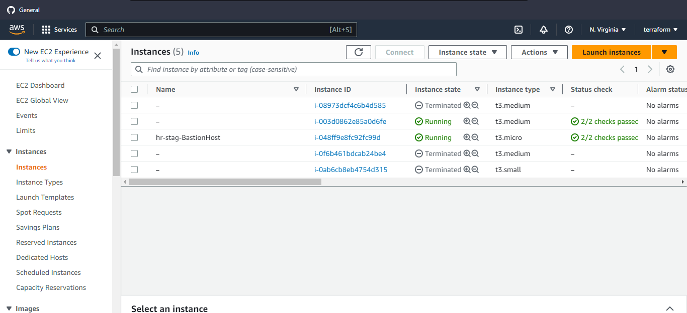
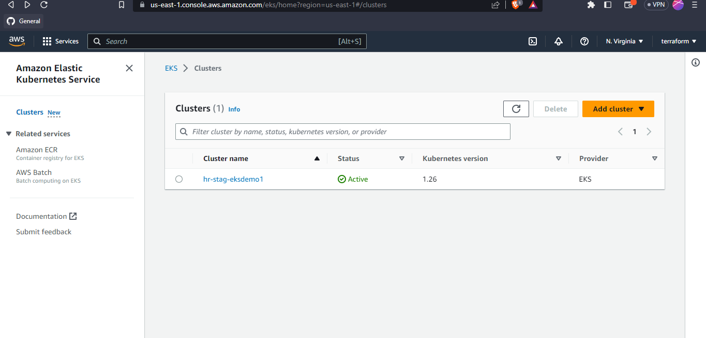
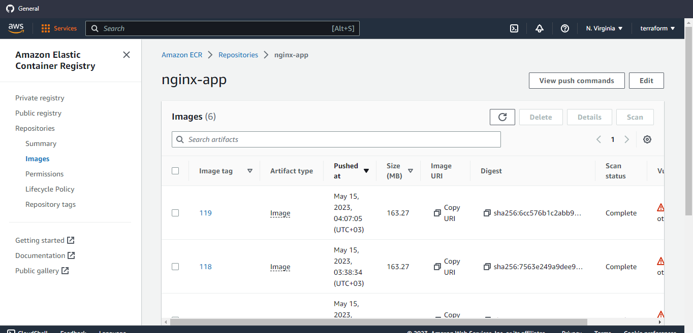
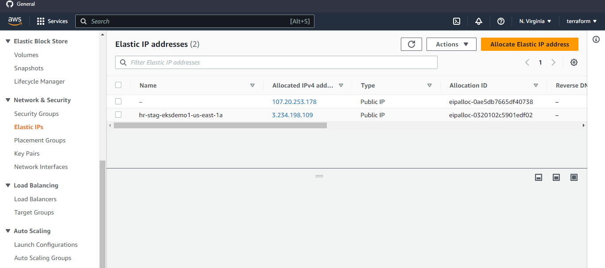
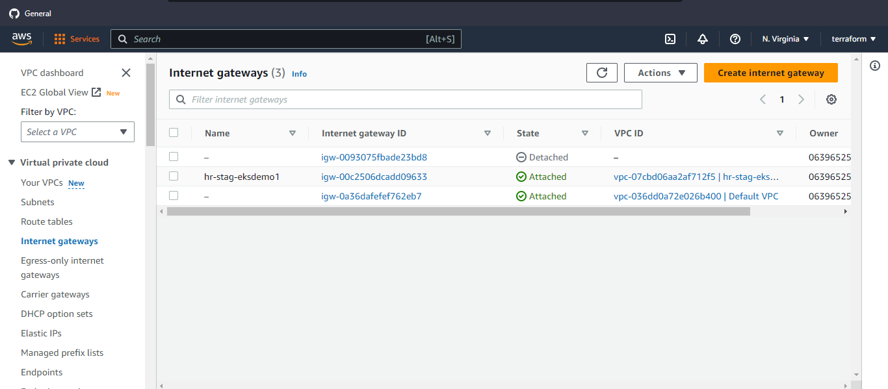
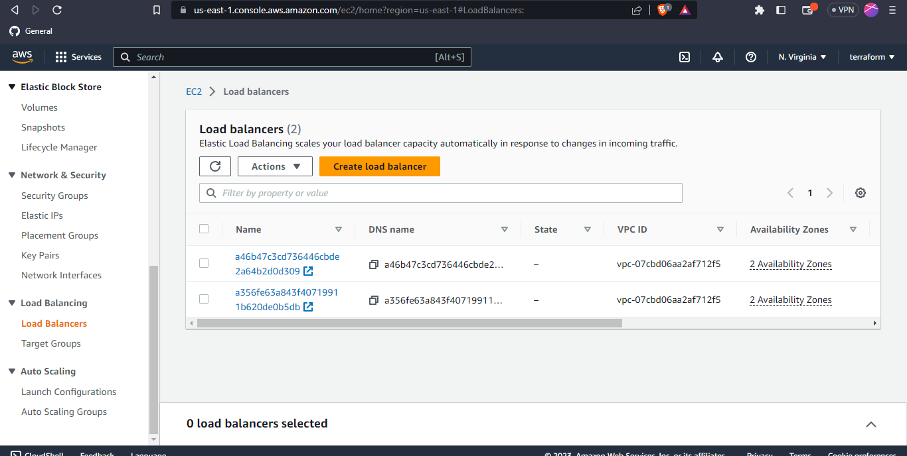
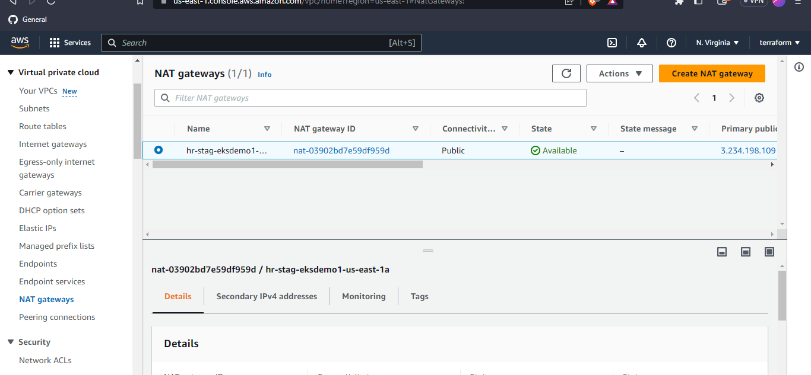
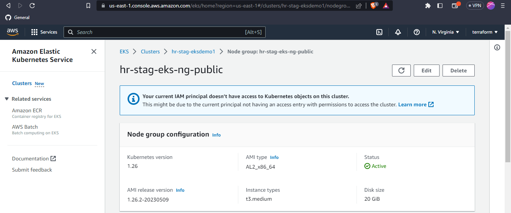
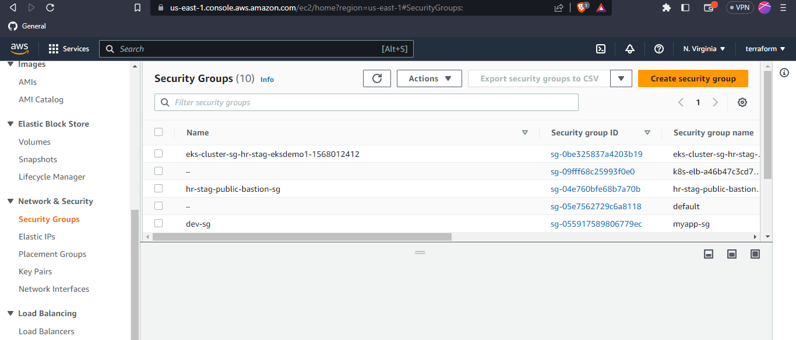
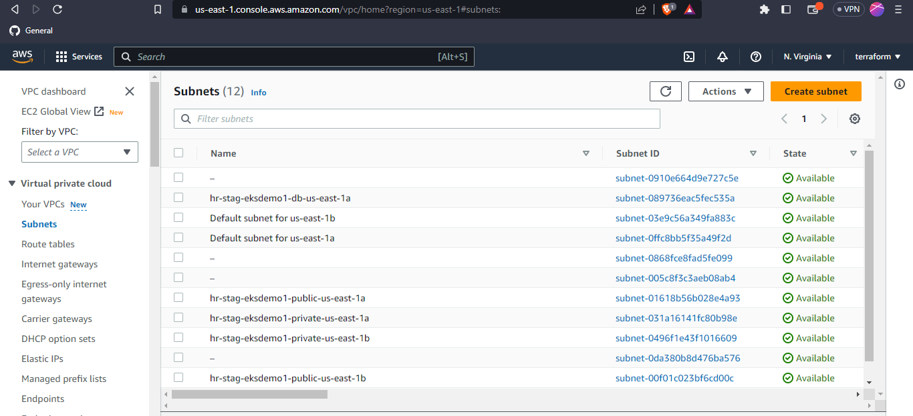

## Amazon EKS Cluster Setup and Docker Image Deployment

This section guides you through updating your kubeconfig for an Amazon EKS cluster and pushing Docker images to an ECR repository.

### Step 3: Update Kubeconfig for Amazon EKS Cluster

To update the kubeconfig for your Amazon EKS cluster, execute the following command:

    ```shell
    aws eks update-kubeconfig --name hr-stag-eksdemo1 --region us-east-1

### Step 4: Build and Push Docker Images to ECR

To deploy your application, you need to build Docker images and push them to your Amazon Elastic Container Registry (ECR) repository. Follow these steps:

#### Prerequisites

- Ensure you have the AWS CLI installed and configured with the necessary credentials.
- Make sure Docker is installed on your local machine.

#### Building and Pushing Docker Images

1. Retrieve ECR Repository URL: Go to your AWS Management Console and locate your ECR repository. Make a note of its URL.

2. Log in to ECR: Use the AWS CLI to authenticate Docker to your ECR repository. Run the following command, replacing `<YOUR_ECR_REPO_URL>` with your actual ECR repository URL:

   ```shell
   aws ecr get-login-password --region us-east-1 | docker login --username AWS --password-stdin <YOUR_ECR_REPO_URL>

# Building, tagging and Pushing Docker Images

1. Navigate to the directories containing your FlaskApp/Dockerfile and db/Dockerfile, then run the following commands:

```shell
docker build -t myapp:latest .
docker tag myapp:latest <YOUR_ECR_REPO_URL>:latest
docker push <YOUR_ECR_REPO_URL>:latest
```
Deploying Kubernetes Manifests and Ingress

Change to the `k8s-manifests` directory and run the following `kubectl` commands. Be sure to edit `deployment.yml` to include the correct Docker image:
```
    kubectl apply -f pv.yml -f pvc.yml -f db-service.yml -f ConfigMap-db.yml -f statfullset.yml
    kubectl apply -f ConfigMap-app.yml -f app-service.yml -f deployment.yml
    kubectl apply -f k8s/ingress.yml
    kubectl get ing
    helm repo add ingress-nginx https://kubernetes.github.io/ingress-nginx
    helm repo update
    helm install ingress-nginx ingress-nginx/ingress-nginx

```
After getting ingress loadbalancer URL then browse it, you should see the following:


##
# Let's discuss about Github actions pipeline.
 before running the pipeline you need to configure variables as shown in the following screenshot:

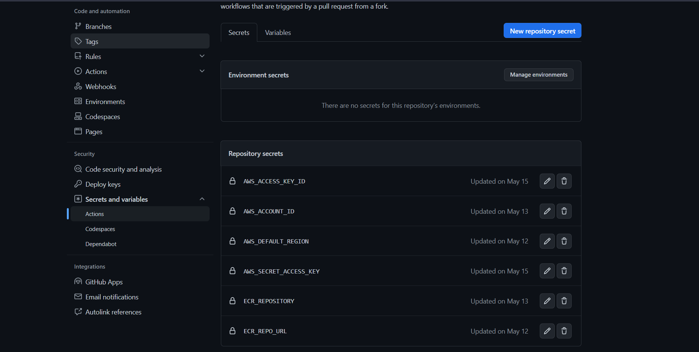

Then run it so easily


